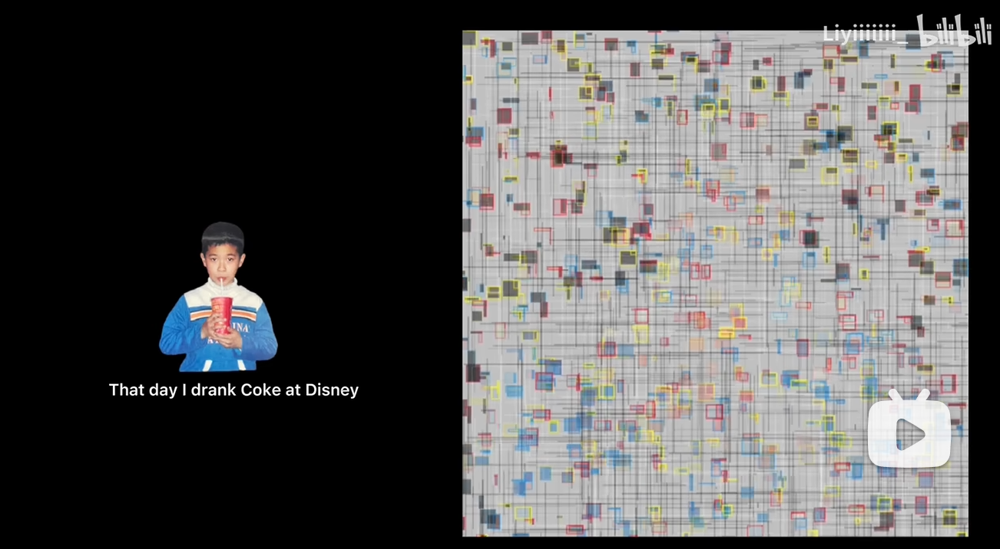

# spen0924_9103_tut01

---

## 🖼️ Project Overview

Welcome to **Shidi Peng's IDEA9103 Final Project**!  
Our goal is to recreate a famous artwork using **p5.js**, blending creative coding with conceptual depth.

Our team consists of **4 members**, each contributing to design, development, and storytelling.

---

## 🎨 Imaging Technique Inspiration

I’m inspired by the **low-fidelity, pixelated layering** technique used in the images below. Rectangles are added bit by bit to form a blurry face, evoking the impressionistic nature of human memory—distorted, faded, and fragmented.

This technique reflects how we recall information: not all at once, but in scattered fragments that gradually coalesce. I aim to incorporate this **gradual build-up** and **Lo-fi aesthetic** into my project to simulate the process of memory reconstruction.

  

---

## 🧠 Coding Technique Exploration

I want to **gradually reconstruct an image** by randomly selecting and drawing pixel blocks over time, mimicking the process of memory recall.

The technique I found doesn't match my idea exactly—it draws randomly sized pixelated rectangles in random locations. However, it still inspires me. I plan to **modify it** so that the blocks **accumulate in their correct positions**, gradually revealing the full image.

🔗 [View the original sketch on p5.js Editor](https://editor.p5js.org/pattvira/sketches/t60YF1GVJ)

---

## ✅ Formatting Tips

Use Markdown to format your answers clearly:
- Add **headings** to organize sections
- Use **bold** or *italic* for emphasis
- Embed images with ``
- Include links with `[link text](URL)`